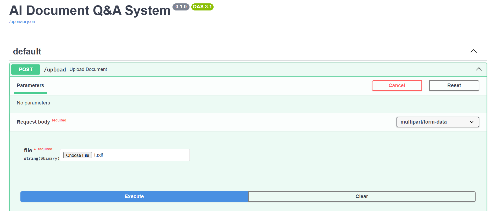

# 📄 AI Document Q&A System (RAG)

An end-to-end production-ready Retrieval-Augmented Generation (RAG) system that allows users to upload PDF/DOCX documents and ask context-aware questions using **FastAPI, LangChain, LangGraph, FAISS, and Groq LLM**.  

### Objective  
Enable users to upload documents and query them using natural language with accurate, context-based answers.  

### Target Users  
- Business analysts  
- Researchers  
- Students  
- Business users  

### Functional Requirements  
- Upload PDF/DOCX  
- Automatic chunking and embedding  
- Store vectors in FAISS  
- Query by document  
- Context-aware answers  
- No hallucinations  

### Non-Functional Requirements  
- Low latency (<3s)  
- Scalable ingestion  
- Stateless API  
- Docker support  

### Success Metrics  
- Answer relevance  
- Zero hallucination rate  
- Query response time  

---

## 🚀 Features

- Upload PDF & DOCX documents  
- Chunking + Embedding with FAISS  
- Per-document querying using metadata filtering  
- Hallucination-controlled answers  
- LangGraph-based agent workflow  
- Scalable FastAPI backend  
- Dockerized deployment  

---

## 🧠 Tech Stack

- Backend: FastAPI  
- LLM: Groq (LLaMA 3.3)  
- Vector DB: FAISS  
- Frameworks: LangChain, LangGraph  
- Embeddings: Sentence Transformers  

---

## 🏗 Architecture
- Upload → Chunk → Embed → Store (FAISS)  
- Query → Retrieve (MMR) → Generate (LLM)  

---

## 📂 Project Structure

app/  
├── agent/ # LangGraph logic  
├── api/ # FastAPI routes  
├── rag/ # RAG pipeline  
├── core/ # config & task queue  
└── main.py  

---


## 🔧.env Setup

GROQ_API_KEY=groq_api_key  
EMBEDDING_MODEL=sentence-transformers/all-MiniLM-L6-v2  
VECTOR_DB=faiss  
MAX_CONCURRENT_TASKS=5  
RATE_LIMIT=10  

---

## 📦 Setup

```bash
python -m venv .venv
.venv\Scripts\activate
pip install -r requirements.txt
uvicorn app.main:app --reload
```

---

## 🐳 Run with Docker

docker-compose up --build  

---

## 🧹 Reset Vector Store

Remove-Item -Recurse -Force data\vectorstore  

---

## 📊 Example  


